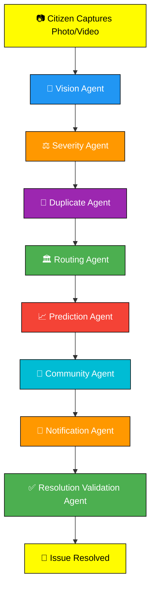
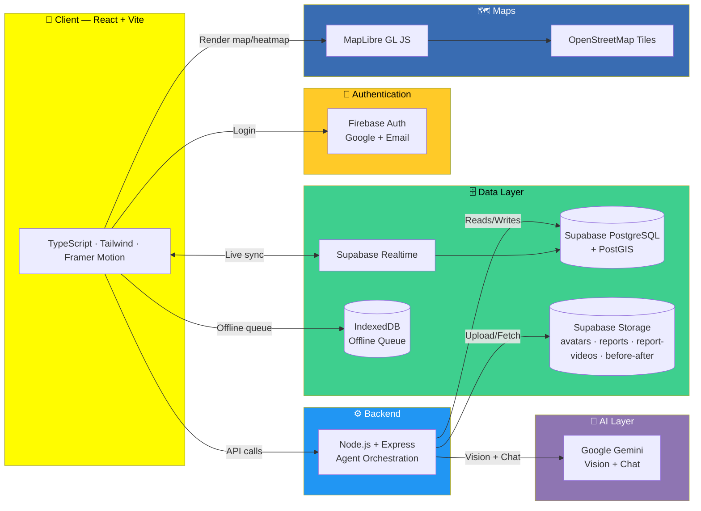

<div align="center">

# 📸 SnapFix AI

### Snap. Report. Resolve.

**An AI-powered hyperlocal civic issue reporting platform that enables citizens to instantly report public infrastructure problems using AI vision, real-time collaboration, and intelligent municipal routing.**

[](#)
[](#license)
[](#)
[](#)
[](#contributing)
[](#)

[](#)
[](#)
[](#)
[](#)
[](#)
[](#)
[](#)
[](#)

<br />

**[Live Demo](#) · [Documentation](#) · [Report Bug](#) · [Request Feature](#)**

<br />


</div>

<br />

> [!NOTE]
> SnapFix AI is built for the **Vibe2Ship Hackathon** as a production-grade civic-tech reference implementation — not a toy prototype. Every architectural decision below is documented and intentional.

---

## 📑 Table of Contents

- [About](#-about)
- [Why SnapFix AI](#-why-snapfix-ai)
- [Key Features](#-key-features)
- [AI Workflow](#-ai-workflow)
- [Screenshots](#-screenshots)
- [Live Demo](#-live-demo)
- [Video Demo](#-video-demo)
- [Architecture Diagram](#-architecture-diagram)
- [Folder Structure](#-folder-structure)
- [Installation](#-installation)
- [Environment Variables](#-environment-variables)
- [Running Locally](#-running-locally)
- [Production Build](#-production-build)
- [Deployment](#-deployment)
- [Database](#-database)
- [Firebase Setup](#-firebase-setup)
- [Supabase Setup](#-supabase-setup)
- [AI Configuration](#-ai-configuration)
- [Map Configuration](#-map-configuration)
- [Feature Modules](#-feature-modules)
- [Roadmap](#-roadmap)
- [Performance](#-performance)
- [Security](#-security)
- [Scalability](#-scalability)
- [Accessibility](#-accessibility)
- [Internationalization](#-internationalization)
- [Contributing](#-contributing)
- [Coding Standards](#-coding-standards)
- [Git Workflow](#-git-workflow)
- [Pull Request Guide](#-pull-request-guide)
- [Issue Templates](#-issue-templates)
- [FAQ](#-faq)
- [Troubleshooting](#-troubleshooting)
- [License](#-license)
- [Authors](#-authors)
- [Acknowledgements](#-acknowledgements)
- [Future Scope](#-future-scope)

---

## 🏙️ About

**SnapFix AI** is an intelligent **civic-tech platform** built for modern **smart cities**. It closes the gap between *a citizen noticing a problem* and *a municipal department fixing it* — collapsing what is usually a multi-step bureaucratic form into a single camera tap.

A citizen opens the app, the camera launches instantly, they capture a photo or short video of a civic issue — a pothole, a water leak, an overflowing garbage bin, a broken streetlight — and **AI vision does the rest**:

```
📷  Capture  →  🧠 Detect  →  ⚖️ Score Severity  →  🔁 Check Duplicates
   →  🏛️ Route to Department  →  📈 Predict Hotspots  →  👥 Notify Community
   →  ✅ Verify  →  🛠️ Resolve  →  🎉 Celebrate
```

No forms. No category dropdowns. No manually selecting a department. Just **snap, and the system understands**.

SnapFix AI is designed for:

| 🏛️ Municipal Corporations | 🌆 Smart Cities | 👤 Citizens | 🤝 NGOs | 🎓 Universities | 🏆 Hackathons |
|---|---|---|---|---|---|
| Faster triage, less paperwork | Live infrastructure intelligence | One-tap reporting | Community accountability tools | GovTech research & teaching | Reference-grade architecture |

---

## 💡 Why SnapFix AI

> [!TIP]
> Most civic complaint systems fail not because citizens don't care — they fail because **reporting is tedious and resolution is invisible**. SnapFix AI fixes both halves of that problem.

| Traditional Municipal Complaint Systems | SnapFix AI |
|---|---|
| Long multi-field forms | One photo, AI fills in the rest |
| Manual category selection | AI Vision auto-classifies the issue |
| No severity prioritization | AI-scored severity & impact (0–10) |
| Duplicate complaints pile up | AI Duplicate Agent merges nearby reports |
| Manual routing to departments | AI Routing Agent assigns automatically |
| No visibility into resolution | Live status timeline, before/after proof |
| No community trust signal | Community verification & voting |
| Reactive only | Prediction Agent forecasts future hotspots |
| Reporting feels like a chore | Gamified: points, badges, streaks, leaderboards |

---

## ✨ Key Features

<table>
<tr>
<td width="33%" valign="top">

### 🧠 AI & Intelligence
- AI Vision issue detection (Gemini)
- Automatic severity scoring
- Duplicate detection (geo-radius)
- Smart department routing
- Hotspot prediction
- AI Chat Assistant

</td>
<td width="33%" valign="top">

### 🗺️ Maps & Reporting
- Real-time reporting
- Live interactive map
- Heatmap visualization
- Camera-first capture
- Offline reporting + sync
- Realtime feeds

</td>
<td width="33%" valign="top">

### 👥 Community
- Community verification
- Voting & disputes
- Comments (nested, moderated)
- Stories (24h ephemeral feed)
- Bookmarks
- Notifications

</td>
</tr>
<tr>
<td width="33%" valign="top">

### 🎮 Gamification
- Points & leveling
- Badges & achievements
- Daily streaks
- Weekly/monthly leaderboards
- SnapScore profile system
- Analytics dashboards

</td>
<td width="33%" valign="top">

### 🔐 Platform & Access
- Firebase Authentication
- Role-based access control
- Department dashboard
- Admin dashboard
- Audit logs
- Row Level Security

</td>
<td width="33%" valign="top">

### 🛠️ Experience & Quality
- Dark mode
- Multi-language support
- PWA installable
- Fully responsive
- Accessibility-first
- Performance optimized

</td>
</tr>
</table>

<details>
<summary><strong>📂 Click to expand the full feature list</strong></summary>

<br />

| Category | Highlights |
|---|---|
| **AI & Vision** | Gemini Vision classification across 9 issue categories · confidence-scored severity · 0–10 impact score · annotated image overlays · report-aware AI Chat Assistant |
| **Reporting & Media** | Camera-first UX, no forms · image + video capture · auto GPS + reverse geocoding · before/after proof uploads · offline-first IndexedDB queue with background sync |
| **Maps & Geospatial** | Severity-coded live markers · toggleable heatmap · PostGIS-backed nearby-issue radius search · hotspot prediction overlays |
| **Community & Social** | Verify / dispute / duplicate-flag voting · nested moderated comments · likes on reports/comments/stories · 24h ephemeral Stories feed · bookmarking & history |
| **Gamification & Identity** | Append-only points ledger · criteria-based badges · daily streaks · weekly/monthly/all-time leaderboards · public SnapScore profile |
| **Admin & Operations** | Role-based access (citizen / officer / admin) · department & admin dashboards · full audit trail · per-report status timeline |
| **Platform Quality** | Supabase Realtime updates · dark mode · English + Hindi at launch · installable PWA · accessibility-checked · code-split & Lighthouse-audited |

</details>

---

## 🤖 AI Workflow

SnapFix AI's core differentiator is its **8-agent AI pipeline** — every report passes through a fully logged, auditable chain of specialized agents.



| # | Agent | Responsibility |
|---|---|---|
| 1 | **Vision Agent** | Analyzes the captured image/video using Gemini Vision and classifies the civic issue into a category with a confidence score. |
| 2 | **Severity Agent** | Assesses urgency and assigns a severity level plus a 0–10 impact score, factoring in visual cues and category risk. |
| 3 | **Duplicate Agent** | Performs a geo-radius search against recent nearby reports to detect and merge duplicates, preventing complaint fragmentation. |
| 4 | **Routing Agent** | Maps the detected category to the correct municipal department and assigns the report automatically. |
| 5 | **Prediction Agent** | Analyzes historical patterns per ward/category to forecast future hotspots before they escalate. |
| 6 | **Community Agent** | Identifies nearby citizens to request verification, strengthening report trustworthiness through crowd consensus. |
| 7 | **Notification Agent** | Dispatches real-time in-app, push, and email notifications at every meaningful state change. |
| 8 | **Resolution Validation Agent** | Compares before/after evidence submitted by department officers to confirm genuine resolution before closing a report. |

> [!IMPORTANT]
> Every agent execution — successful or failed — writes a structured log entry (input, output, confidence, latency, model/prompt version) to a unified audit table, making the entire pipeline observable and debuggable end to end.

---

## 🖼️ Screenshots

<div align="center">

| Camera & AI Detection | Live Map & Heatmap | Community Feed |
|:---:|:---:|:---:|
|  |  |  |

| Leaderboard & SnapScore | Issue Tracking | Admin Dashboard |
|:---:|:---:|:---:|
|  |  |  |

*Screenshots above are placeholders — replace with real captures before publishing.*

</div>

---

## 🚀 Live Demo

> 🔗 **Live URL:** `https://snapfix-ai.vercel.app` *(placeholder — update once deployed)*

| Environment | URL | Status |
|---|---|---|
| Production | `https://snapfix-ai.vercel.app` | 🟡 Placeholder |
| Staging | `https://staging.snapfix-ai.vercel.app` | 🟡 Placeholder |

---

## 🎬 Video Demo

<div align="center">

[](#)

*Click to watch the full product walkthrough (placeholder link).*

</div>

---

## 🏗️ Architecture Diagram



---

## 📁 Folder Structure

```
snapfix-ai/
├── public/                      # Static assets, PWA manifest, icons
├── src/
│   ├── assets/                  # Images, illustrations, fonts
│   ├── components/              # Shared, reusable UI components
│   │   ├── ui/                  # shadcn/ui primitives
│   │   ├── ReportCard.tsx
│   │   ├── SeverityBadge.tsx
│   │   ├── StatusBadge.tsx
│   │   ├── BottomNav.tsx
│   │   └── ...
│   ├── features/                # Feature-based domains
│   │   ├── auth/
│   │   ├── reports/
│   │   ├── map/
│   │   ├── comments/
│   │   ├── leaderboard/
│   │   ├── notifications/
│   │   ├── ai-chat/
│   │   └── admin/
│   ├── hooks/                   # Shared custom hooks
│   ├── lib/
│   │   ├── api/                 # Data-access layer (Supabase queries)
│   │   ├── supabaseClient.ts
│   │   ├── firebaseClient.ts
│   │   └── geminiClient.ts
│   ├── pages/                   # Route-level page components
│   ├── types/                   # Shared TypeScript types (DB-aligned)
│   ├── App.tsx
│   └── main.tsx
├── supabase/
│   └── schema/
│       └── SnapFixAI_Database_Schema.sql
├── docs/
│   ├── README.md                # Database deep-dive
│   ├── ARCHITECTURE.md
│   ├── DESIGN_SYSTEM.md
│   └── PROJECT_RULES.md
├── .env.example
├── tailwind.config.ts
├── vite.config.ts
├── tsconfig.json
└── package.json
```

---

## 🧰 Installation

```bash
git clone https://github.com/snapfix-ai/snapfix-ai.git
cd snapfix-ai
npm install
```

> [!NOTE]
> Requires **Node.js ≥ 18** and **npm ≥ 9**. We recommend [nvm](https://github.com/nvm-sh/nvm) for version management.

---

## 🔑 Environment Variables

Create a `.env` file using `.env.example` as a template:

```bash
# ── Firebase Authentication ─────────────────────────────
VITE_FIREBASE_API_KEY=
VITE_FIREBASE_AUTH_DOMAIN=
VITE_FIREBASE_PROJECT_ID=
VITE_FIREBASE_STORAGE_BUCKET=
VITE_FIREBASE_MESSAGING_SENDER_ID=
VITE_FIREBASE_APP_ID=

# ── Supabase ─────────────────────────────────────────────
VITE_SUPABASE_URL=
VITE_SUPABASE_ANON_KEY=
SUPABASE_SERVICE_ROLE_KEY=          # server-side only — never expose to client

# ── Google Gemini / Google AI Studio ────────────────────
GEMINI_API_KEY=

# ── Maps ─────────────────────────────────────────────────
VITE_MAPTILER_API_KEY=              # or your MapLibre tile provider of choice

# ── App Config ───────────────────────────────────────────
VITE_APP_ENV=development
```

> [!WARNING]
> Never commit `.env` to version control. `SUPABASE_SERVICE_ROLE_KEY` and `GEMINI_API_KEY` must only be used in server-side code.

---

## 💻 Running Locally

```bash
npm run dev          # http://localhost:5173
npm run lint          # ESLint
npm run format         # Prettier
npm run type-check      # TypeScript strict check
npm run test            # Test suite
```

---

## 📦 Production Build

```bash
npm run build         # Outputs optimized static build to /dist
npm run preview        # Preview the production build locally
```

---

## ☁️ Deployment

SnapFix AI is optimized for one-click deployment on **Vercel**.

[](#)

```bash
npm install -g vercel
vercel --prod
```

Set all variables from [Environment Variables](#-environment-variables) in your hosting provider's dashboard before deploying.

---

## 🗄️ Database

SnapFix AI runs on **Supabase PostgreSQL** (region: `ap-south-1`, Mumbai) with **PostGIS** enabled for accurate geospatial queries.

| Category | Tables |
|---|---|
| Identity & Org | `profiles`, `departments`, `department_staff`, `login_history`, `audit_logs` |
| Core Reporting | `reports`, `report_media`, `status_history`, `verifications`, `votes`, `comments`, `stories`, `bookmarks` |
| AI Pipeline | `ai_analysis`, `agent_logs`, `predictions`, `ai_conversations`, `ai_messages` |
| Gamification | `badges`, `user_badges`, `points_ledger`, `streaks`, `leaderboard` |
| Notifications & Analytics | `notifications`, `analytics_snapshots` |

**25 tables**, fully normalized, UUID primary keys throughout, soft deletes (`deleted_at`) everywhere, and **Row Level Security enabled on every table**.

📄 Full schema: [`supabase/schema/SnapFixAI_Database_Schema.sql`](./supabase/schema/SnapFixAI_Database_Schema.sql)
📄 Full data dictionary: [`docs/README.md`](./docs/README.md)

```sql
-- Run once against a fresh Supabase project
psql "$DATABASE_URL" -f supabase/schema/SnapFixAI_Database_Schema.sql
```

---

## 🔥 Firebase Setup

1. Create a project at [console.firebase.google.com](https://console.firebase.google.com)
2. Enable **Authentication** → Sign-in providers → **Google** and **Email/Password**
3. Copy your Firebase config values into `.env`
4. Add your deployed domain (and `localhost`) to **Authorized Domains**

---

## 🟩 Supabase Setup

1. Create a project at [supabase.com](https://supabase.com) (recommended region: `ap-south-1`)
2. Enable the **PostGIS** extension under *Database → Extensions*
3. Run `SnapFixAI_Database_Schema.sql` in the SQL Editor
4. Create the following **Storage buckets**: `avatars`, `reports`, `report-videos`, `before-after`
5. Copy your project URL and `anon` key into `.env`
6. Keep the `service_role` key **server-side only**

---

## 🧠 AI Configuration

1. Generate an API key at [Google AI Studio](https://aistudio.google.com)
2. Add it to `.env` as `GEMINI_API_KEY` (server-side only)
3. The Vision Agent calls Gemini's vision-capable model for issue classification
4. The AI Chat Assistant calls Gemini's chat model with report-aware context injection

---

## 🗺️ Map Configuration

SnapFix AI uses **MapLibre GL JS** with **OpenStreetMap** tiles — fully open-source, no vendor lock-in, no per-request billing surprises.

1. (Optional) Get a free tile-hosting API key from a provider like MapTiler or Stadia Maps for production-grade tile caching
2. Add it to `.env` as `VITE_MAPTILER_API_KEY`
3. For local development, public OSM demo tiles work out of the box with no key required

---

## 🧩 Feature Modules

| Module | Description |
|---|---|
| `features/auth` | Firebase login, role-aware route protection, session context |
| `features/reports` | Report creation, feed, detail view, status timeline |
| `features/map` | MapLibre map, heatmap layer, nearby-issue radius search |
| `features/comments` | Nested comments, voting, moderation |
| `features/leaderboard` | Points, badges, streaks, ranking views |
| `features/notifications` | Realtime in-app, push, and email notifications |
| `features/ai-chat` | Gemini-powered conversational assistant |
| `features/admin` | Department & admin dashboards, moderation, audit trail |

---

## 🗺️ Roadmap

- [x] Core reporting flow with AI classification
- [x] 8-agent AI pipeline
- [x] Community verification & gamification
- [x] Realtime notifications
- [ ] Native mobile apps (React Native)
- [ ] Multi-city tenant support
- [ ] Voice-based reporting
- [ ] WhatsApp bot integration
- [ ] Public open-data API for researchers
- [ ] Department SLA automation & escalation
- [ ] Predictive budget allocation insights for municipalities

---

## ⚡ Performance

- Route-level code splitting and lazy loading
- Image compression prior to upload
- `stale-while-revalidate` caching for feed/map data
- Lighthouse-audited Core Web Vitals
- PostGIS spatial indexes for sub-second radius queries at scale

---

## 🔒 Security

- Firebase Authentication for identity; Supabase Row Level Security on every table as defense-in-depth
- `service_role` key strictly server-side, never shipped to the client
- Soft deletes and full audit logging (`audit_logs`, `status_history`, `login_history`) for accountability
- No secrets committed to the repository — all sensitive config via environment variables

---

## 📈 Scalability

- UUID primary keys throughout — safe for distributed, offline-first inserts
- Denormalized counters (points, verification counts) synced via triggers for fast reads at scale
- `agent_logs` designed as a single unified table for full pipeline observability without table sprawl
- Append-only `points_ledger` avoids race conditions under concurrent writes
- Architecture designed to scale from a single city to a multi-tenant, multi-city deployment

---

## ♿ Accessibility

- Semantic HTML and ARIA labels on all icon-only controls
- Color-contrast-checked severity and status badges
- Full keyboard navigability
- Respects `prefers-reduced-motion`

---

## 🌐 Internationalization

- English and Hindi supported at launch via the in-app Language Selection screen
- i18n architecture designed for easy addition of further regional languages

---

## 🤝 Contributing

Contributions are warmly welcomed — SnapFix AI is built to be a genuinely open civic-tech reference project.

```bash
# 1. Fork the repository
# 2. Create your feature branch
git checkout -b feature/amazing-feature

# 3. Commit your changes
git commit -m "feat: add amazing feature"

# 4. Push to your branch
git push origin feature/amazing-feature

# 5. Open a Pull Request
```

Please read [Coding Standards](#-coding-standards) and the [Pull Request Guide](#-pull-request-guide) before submitting.

---

## 📐 Coding Standards

- **TypeScript strict mode** — no `any` type
- **Feature-based architecture** — organize by domain, not file type
- **No inline styles** — Tailwind utility classes only
- **shadcn/ui** for component primitives wherever applicable
- **Lucide Icons** exclusively
- **Framer Motion** for all transitions and micro-interactions
- Every data-driven screen implements **Loading / Empty / Error / Offline / Success** states
- Run `npm run lint && npm run type-check` before every commit

---

## 🌳 Git Workflow

We follow a simplified **trunk-based** workflow:

```
main            → always deployable
feature/*        → new features
fix/*             → bug fixes
chore/*           → tooling, deps, docs
```

Commit messages follow [Conventional Commits](https://www.conventionalcommits.org/):

```
feat: add duplicate detection radius config
fix: correct severity badge contrast ratio
docs: update Supabase setup instructions
chore: bump dependencies
```

---

## 🔀 Pull Request Guide

- Keep PRs focused and reasonably small
- Link the related issue (`Closes #123`)
- Include before/after screenshots for UI changes
- Ensure CI passes (lint, type-check, build)
- One approving review required before merge

---

## 🐛 Issue Templates

When filing an issue, please include:

- **Bug reports:** steps to reproduce, expected vs actual behavior, screenshots, environment (browser/OS)
- **Feature requests:** problem statement, proposed solution, alternatives considered
- **Questions:** check the [FAQ](#-faq) first

---

## ❓ FAQ

<details>
<summary><strong>Does SnapFix AI work without an internet connection?</strong></summary>
<br />
Yes. Reports captured offline are queued locally via IndexedDB and automatically synced once connectivity is restored.
</details>

<details>
<summary><strong>Which AI model powers the issue detection?</strong></summary>
<br />
Google Gemini Vision, accessed via Google AI Studio, handles image classification, severity scoring, and the conversational AI Chat Assistant.
</details>

<details>
<summary><strong>Can this be deployed for a different city or country?</strong></summary>
<br />
Yes — the schema is ward/city/department agnostic. Seed your own <code>departments</code> table and the routing logic adapts automatically.
</details>

<details>
<summary><strong>Is Google Maps required?</strong></summary>
<br />
No. SnapFix AI uses MapLibre GL JS with OpenStreetMap tiles, which is fully open-source and avoids per-request map billing.
</details>

<details>
<summary><strong>How is duplicate detection performed?</strong></summary>
<br />
Using PostGIS geospatial queries (<code>ST_DWithin</code>) to find same-category reports within a configurable radius and recent time window.
</details>

---

## 🔧 Troubleshooting

| Issue | Likely Cause | Fix |
|---|---|---|
| Blank map | Missing/invalid tile API key | Check `VITE_MAPTILER_API_KEY` in `.env` |
| Login fails silently | Firebase domain not authorized | Add your domain under Firebase Console → Authorized Domains |
| Upload fails | Storage bucket missing | Confirm all 4 buckets exist in Supabase Storage |
| Empty AI response | Invalid/missing Gemini key | Verify `GEMINI_API_KEY` is set server-side |
| RLS "permission denied" errors | Using anon key for an admin-only write | Route that write through your backend's `service_role` key |

---

## 📄 License

Distributed under the **MIT License**. See [`LICENSE`](./LICENSE) for full text.

---

## 👥 Authors

Built with ❤️ for the **Vibe2Ship Hackathon** by the SnapFix AI team.

| Role | Name | Links |
|---|---|---|
| Project Lead | *Shubham Kanani* | [GitHub](#) · [LinkedIn](#) |

---

## 🙏 Acknowledgements

- [Google Gemini](https://ai.google.dev/) for AI Vision capabilities
- [Supabase](https://supabase.com) for the open-source Postgres backend
- [Firebase](https://firebase.google.com) for authentication infrastructure
- [MapLibre](https://maplibre.org/) and [OpenStreetMap](https://www.openstreetmap.org/) contributors
- [shadcn/ui](https://ui.shadcn.com/) for accessible component primitives
- The civic-tech and GovTech open-source community

---

## 🔮 Future Scope

SnapFix AI aims to become a reusable civic-tech foundation for **Smart India** initiatives and beyond:

- Multi-city, multi-tenant deployments for municipal corporations
- Native mobile apps for higher offline-first reliability
- Voice and WhatsApp-based reporting channels for greater accessibility
- Predictive analytics for municipal budget allocation
- Open public datasets for researchers and journalists studying public infrastructure

---

<div align="center">

**If SnapFix AI helped you, consider giving it a ⭐ — it genuinely helps the project grow.**

Made with ❤️ for better, more responsive cities.

</div>
